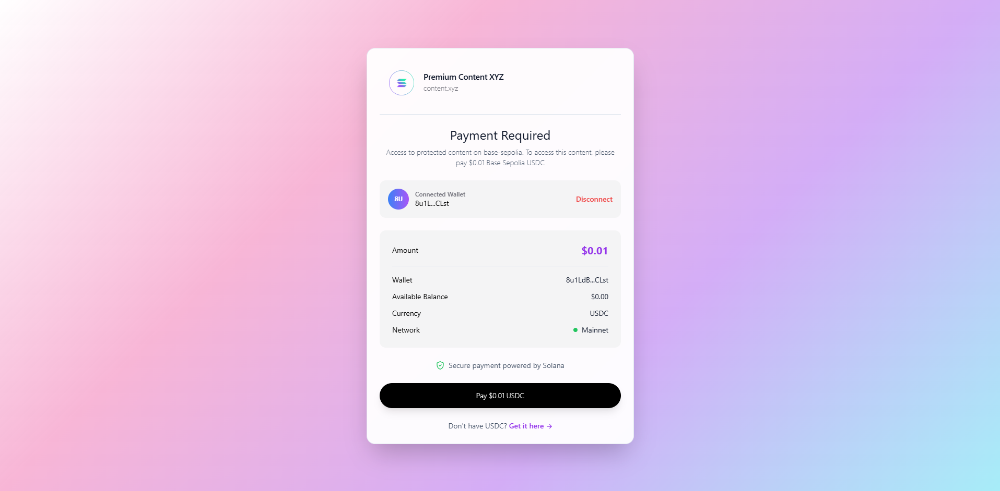
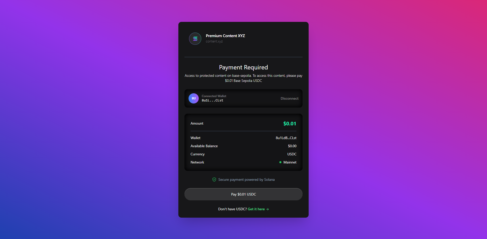
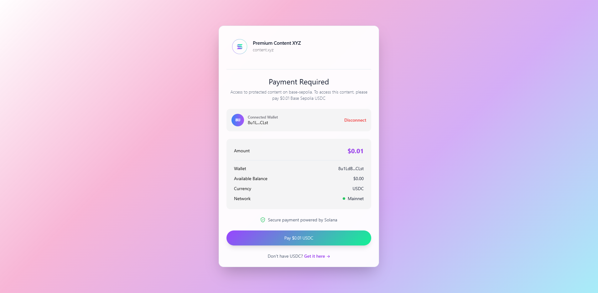
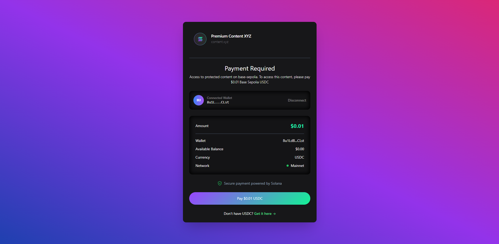
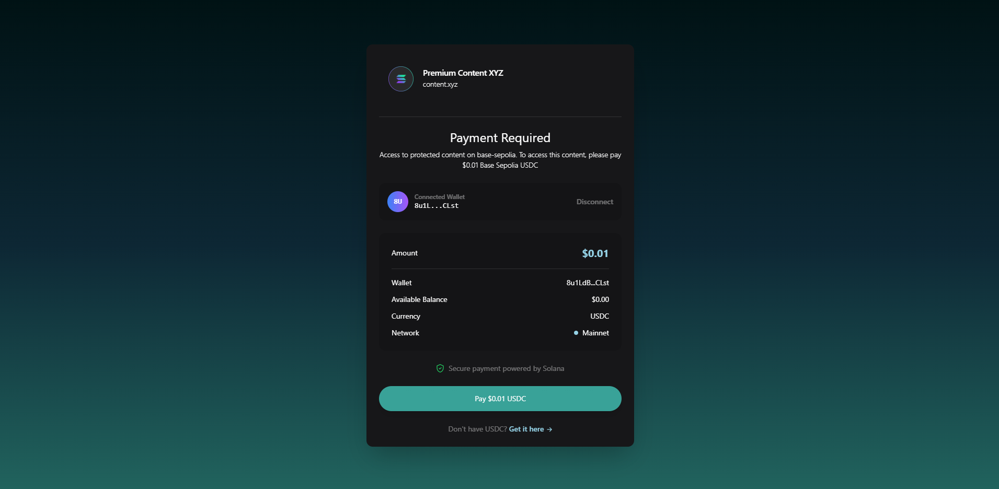
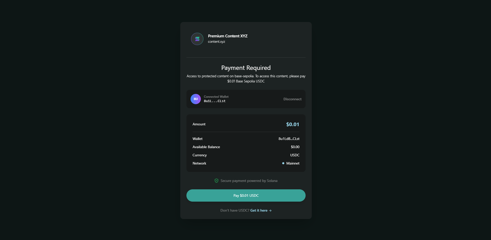
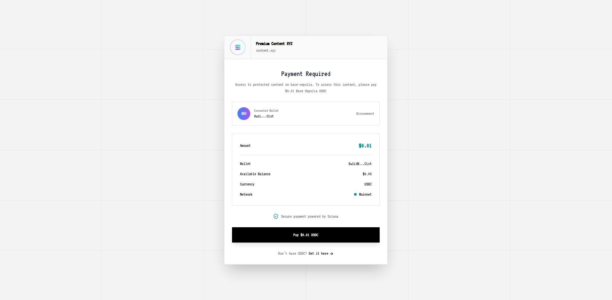
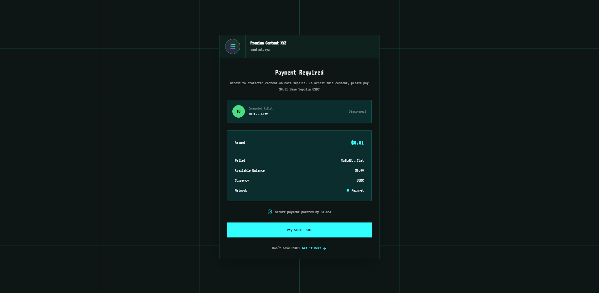

# x402 Solana React Paywall

A reusable React component library that provides drop-in paywall functionality for Solana-based applications using the x402 payment protocol v2.

> **x402 Protocol v2**: This package uses `x402-solana` which implements the x402 v2 specification with CAIP-2 network identifiers, `PAYMENT-SIGNATURE` headers, and improved payload structure. See the [CHANGELOG](./CHANGELOG.md) for details.

## Classic theme

<table>
<tr>
<td width="50%">



</td>
<td width="50%">



</td>
</tr>
</table>

## Solana theme

<table>
<tr>
<td width="50%">



</td>
<td width="50%">



</td>
</tr>
</table>

## Seeker theme

<table>
<tr>
<td width="33.33%">


</td>
<td width="33.33%">



</td>
<td width="33.33%">



</td>
</tr>
</table>

## Terminal theme

<table>
<tr>
<td width="50%">



</td>
<td width="50%">



</td>
</tr>
</table>

## 🚀 Features

- ✅ **Drop-in React Components**: Easy integration with existing apps
- ✅ **Auto-Setup Providers**: Automatically configures wallet providers (or use your own)
- ✅ **Solana Native**: Built specifically for Solana blockchain
- ✅ **Multi-Wallet Support**: Works with Phantom, Solflare, and more
- ✅ **Multiple Themes**: Light, Dark, Solana, Seeker, Terminal themes
- ✅ **Tailwind CSS**: Utility-first styling with customization
- ✅ **shadcn/ui**: Accessible, beautiful components
- ✅ **TypeScript**: Full type safety and IntelliSense
- ✅ **Network Auto-Detection**: Automatically configures mainnet/devnet

## 📋 Prerequisites

- **Node.js**: v18.0.0 or higher
- **React**: v18.0.0 or higher
- **Solana Wallet**: Phantom, Solflare, or any Solana wallet adapter compatible wallet
- **USDC Balance**: For mainnet payments (devnet for testing)

## 📦 Installation

```bash
npm install @payai/x402-solana-react
# or
yarn add @payai/x402-solana-react
# or
pnpm add @payai/x402-solana-react
```

### Install Peer Dependencies

You'll also need Solana wallet adapter packages:

```bash
npm install @solana/wallet-adapter-react @solana/wallet-adapter-react-ui @solana/wallet-adapter-wallets @solana/web3.js
```

## ⚙️ Setup

### 1. Import Styles

Import the required styles in your main file (e.g., `main.tsx` or `App.tsx`):

```tsx
import '@payai/x402-solana-react/styles';
import '@solana/wallet-adapter-react-ui/styles.css';
```

### 2. Environment Variables (Optional - Recommended for Production)

For production use, configure a custom RPC endpoint to avoid rate limiting on public RPCs:

Create a `.env` file (you can copy from the included `.env.example`) and set your RPC URL:

```
# Your Helius/QuickNode/Alchemy RPC URL
VITE_SOLANA_RPC_URL=https://mainnet.helius-rpc.com/?api-key=your_api_key_here
```

Restart the dev server after changing `.env` so Vite picks up updates.

### 3. Wallet Provider Setup (Optional)

**Option A: Auto-Setup (Recommended)** 🎉

The component automatically sets up wallet providers for you! Just use it directly:

```tsx
import { X402Paywall } from '@payai/x402-solana-react';

function App() {
  return (
    <X402Paywall
      amount={0.01}
      description="Premium Content"
      network="solana" // Automatically configures mainnet
    >
      <YourPremiumContent />
    </X402Paywall>
  );
}
```

**Option B: Manual Setup** (if you need custom wallet configuration)

Wrap your app with Solana wallet providers:

```tsx
import { WalletAdapterNetwork } from '@solana/wallet-adapter-base';
import { ConnectionProvider, WalletProvider } from '@solana/wallet-adapter-react';
import { WalletModalProvider } from '@solana/wallet-adapter-react-ui';
import { PhantomWalletAdapter, SolflareWalletAdapter } from '@solana/wallet-adapter-wallets';
import { clusterApiUrl } from '@solana/web3.js';

function App() {
  const network = WalletAdapterNetwork.Mainnet;
  const endpoint = clusterApiUrl(network);
  const wallets = [new PhantomWalletAdapter(), new SolflareWalletAdapter()];

  return (
    <ConnectionProvider endpoint={endpoint}>
      <WalletProvider wallets={wallets} autoConnect={false}>
        <WalletModalProvider>
          <X402Paywall
            amount={0.01}
            description="Premium Content"
            network="solana"
            autoSetupProviders={false} // Disable auto-setup
          >
            <YourPremiumContent />
          </X402Paywall>
        </WalletModalProvider>
      </WalletProvider>
    </ConnectionProvider>
  );
}
```

## 🎯 Quick Start

### Simplest Example (Auto-Setup)

```tsx
import { X402Paywall } from '@payai/x402-solana-react';
import '@payai/x402-solana-react/styles';
import '@solana/wallet-adapter-react-ui/styles.css';

function PremiumPage() {
  return (
    <X402Paywall
      amount={0.02}
      description="Premium AI Chat Access"
      network="solana" // Use 'solana' for mainnet, 'solana-devnet' for testing
      onPaymentSuccess={txId => console.log('Payment successful!', txId)}
    >
      <PremiumContent />
    </X402Paywall>
  );
}
```

### With Custom RPC (Recommended for Production)

```tsx
import { X402Paywall } from '@payai/x402-solana-react';

function PremiumPage() {
  // Set via environment variable: VITE_SOLANA_RPC_URL
  const rpcUrl = import.meta.env.VITE_SOLANA_RPC_URL;

  return (
    <X402Paywall
      amount={0.02}
      description="Premium Content"
      network="solana"
      rpcUrl={rpcUrl} // Avoids rate limiting on public RPCs
      onPaymentSuccess={txId => {
        console.log('Payment successful!', txId);
        // Update your backend, show success message, etc.
      }}
      onPaymentError={error => {
        console.error('Payment failed:', error);
      }}
    >
      <PremiumContent />
    </X402Paywall>
  );
}
```

## 🎨 Themes & Styling

The component comes with multiple built-in themes:

### Available Themes

- `light` - Clean light theme with gradients
- `dark` - Dark theme with pink/purple/blue gradients
- `solana-light` - Official Solana light theme (default)
- `solana-dark` - Official Solana dark theme
- `seeker` - Emerald/teal gradient theme
- `seeker-2` - Enhanced seeker theme with backdrop blur
- `terminal` - Retro terminal green-on-black theme

### Theme Example

```tsx
import { X402Paywall } from '@payai/x402-solana-react';
import { useState } from 'react';

function PremiumPage() {
  const [theme, setTheme] = useState('light');

  return (
    <X402Paywall
      amount={0.02}
      description="Premium Features"
      network="solana"
      theme={theme} // Try: 'light', 'dark', 'solana-light', 'solana-dark', etc.
      onPaymentSuccess={txId => console.log('Paid!', txId)}
    >
      <AdvancedFeatures />
    </X402Paywall>
  );
}
```

### Custom Styling

You can customize further using `classNames` and `customStyles` props:

```tsx
<X402Paywall
  amount={5.0}
  description="Premium Features"
  network="solana"
  theme="dark"
  classNames={{
    container: 'bg-gradient-to-r from-purple-600 to-blue-600',
    button: 'bg-white text-purple-600 hover:bg-gray-50 font-bold',
  }}
  customStyles={{
    button: { boxShadow: '0 10px 30px rgba(153, 69, 255, 0.4)' },
  }}
>
  <AdvancedFeatures />
</X402Paywall>
```

## 📚 API Reference

### X402Paywall Props

| Prop                 | Type                          | Required | Default                                              | Description                                                 |
| -------------------- | ----------------------------- | -------- | ---------------------------------------------------- | ----------------------------------------------------------- |
| `amount`             | `number`                      | ✅       | -                                                    | Payment amount in USDC                                      |
| `description`        | `string`                      | ✅       | -                                                    | Payment description                                         |
| `children`           | `ReactNode`                   | ✅       | -                                                    | Protected content to show after payment                     |
| `network`            | `'solana' \| 'solana-devnet'` | ❌       | `'solana-devnet'`                                    | Solana network to use                                       |
| `wallet`             | `WalletAdapter`               | ❌       | -                                                    | Optional wallet adapter (auto-uses context if not provided) |
| `rpcUrl`             | `string`                      | ❌       | -                                                    | Custom RPC URL (recommended to avoid rate limits)           |
| `autoSetupProviders` | `boolean`                     | ❌       | `true`                                               | Automatically setup wallet providers                        |
| `providerNetwork`    | `WalletAdapterNetwork`        | ❌       | Auto-detected                                        | Network for auto-setup providers                            |
| `providerEndpoint`   | `string`                      | ❌       | -                                                    | Custom endpoint for auto-setup providers                    |
| `apiEndpoint`        | `string`                      | ❌       | `https://x402.payai.network/api/solana/paid-content` | Custom API endpoint                                         |
| `facilitatorUrl`     | `string`                      | ❌       | -                                                    | Custom facilitator URL                                      |
| `theme`              | `ThemePreset`                 | ❌       | `'solana-light'`                                     | Visual theme (see Themes section)                           |
| `logoUrl`            | `string`                      | ❌       | -                                                    | Custom logo URL to display                                  |
| `showBalance`        | `boolean`                     | ❌       | `true`                                               | Show wallet USDC balance                                    |
| `showNetworkInfo`    | `boolean`                     | ❌       | `true`                                               | Show network information                                    |
| `showPaymentDetails` | `boolean`                     | ❌       | `true`                                               | Show payment details section                                |
| `maxPaymentAmount`   | `number`                      | ❌       | -                                                    | Maximum allowed payment amount                              |
| `classNames`         | `ComponentClassNames`         | ❌       | -                                                    | Custom CSS classes for components                           |
| `customStyles`       | `ComponentStyles`             | ❌       | -                                                    | Custom inline styles for components                         |
| `onPaymentStart`     | `() => void`                  | ❌       | -                                                    | Callback when payment starts                                |
| `onPaymentSuccess`   | `(txId: string) => void`      | ❌       | -                                                    | Callback on successful payment                              |
| `onPaymentError`     | `(error: Error) => void`      | ❌       | -                                                    | Callback on payment error                                   |
| `onWalletConnect`    | `(publicKey: string) => void` | ❌       | -                                                    | Callback when wallet connects                               |
| `onDisconnect`       | `() => void`                  | ❌       | -                                                    | Callback when wallet disconnects                            |

See [full API documentation](./docs/API_REFERENCE.md) for complete reference.

## 🛠️ Development

### Setup

```bash
# Clone the repository
git clone https://github.com/payainetwork/x402-solana-react.git
cd x402-solana-react

# Install dependencies
npm install

# Copy environment variables
cp .env.example .env
# Edit .env and add your custom RPC URL (Helius, QuickNode, etc.)
# Example: VITE_SOLANA_RPC_URL=https://mainnet.helius-rpc.com/?api-key=YOUR_KEY

# Start development server
npm run dev
```

### Build

```bash
# Build library
npm run build

# Type check
npm run typecheck

# Lint
npm run lint
```

## 🐛 Troubleshooting

### Common Issues

**"Wallet not connected"**

- Ensure wallet provider is properly configured
- Check that wallet extension is installed and unlocked
- Verify network matches (mainnet vs devnet)

**"Insufficient USDC balance"**

- Check wallet has enough USDC for payment + gas
- On devnet: Use [Solana Faucet](https://faucet.solana.com/) for SOL
- Get devnet USDC from test token faucets like [Circle](https://faucet.circle.com/)

**"RPC rate limit exceeded"**

- Use a custom RPC provider (Helius, QuickNode, Alchemy)
- Set `VITE_SOLANA_RPC_URL` in `.env` file
- Pass via `rpcUrl` prop: `rpcUrl={import.meta.env.VITE_SOLANA_RPC_URL}`
- For production, always use a paid RPC endpoint

**"Transaction failed"**

- Verify network connectivity
- Check Solana network status
- Ensure sufficient SOL for transaction fees

**Styling not working**

- Make sure you imported both required stylesheets:
  ```tsx
  import '@payai/x402-solana-react/styles';
  import '@solana/wallet-adapter-react-ui/styles.css';
  ```
- Check browser console for CSS loading errors
- Verify Tailwind CSS is configured if using custom classes

**"process is not defined" error**

- Use Vite's `import.meta.env` instead of `process.env`
- Example: `import.meta.env.VITE_SOLANA_RPC_URL`

## ✅ Status

**Ready for Production** - Fully functional x402 paywall components with PayAI facilitator integration.

### Features Complete

- ✅ Core paywall component with Solana integration
- ✅ **x402 Protocol v2** - Full support via `x402-solana`
- ✅ Payment processing via x402 protocol
- ✅ Multi-wallet support (Phantom, Solflare, etc.)
- ✅ Beautiful Solana-themed UI with Tailwind CSS
- ✅ TypeScript support with full type safety
- ✅ Devnet integration with PayAI facilitator
- ✅ Responsive design and accessibility

### x402 v2 Protocol

This package supports the x402 v2 specification which includes:

| Feature            | v1                        | v2                             |
| ------------------ | ------------------------- | ------------------------------ |
| **Network Format** | `solana`, `solana-devnet` | CAIP-2 format (auto-converted) |
| **Payment Header** | `X-PAYMENT`               | `PAYMENT-SIGNATURE`            |
| **Amount Field**   | `maxAmountRequired`       | `amount`                       |

**Note**: You can still use simple network names (`solana`, `solana-devnet`) in your code - the library automatically converts them to CAIP-2 format internally.

## 🤝 Contributing

This project is currently in early development. Contributions welcome!

## 📄 License

MIT License

## 🔗 Related Projects

- [x402-solana](https://www.npmjs.com/package/x402-solana) - Base Solana payment protocol implementation (x402 v2)
- [x402](https://github.com/coinbase/x402) - Core x402 payment protocol specification
- [PayAI Network](https://payai.network) - x402 payment infrastructure and facilitator

---

Built with ❤️ for the Solana ecosystem
